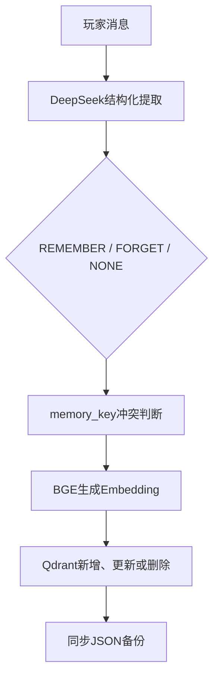
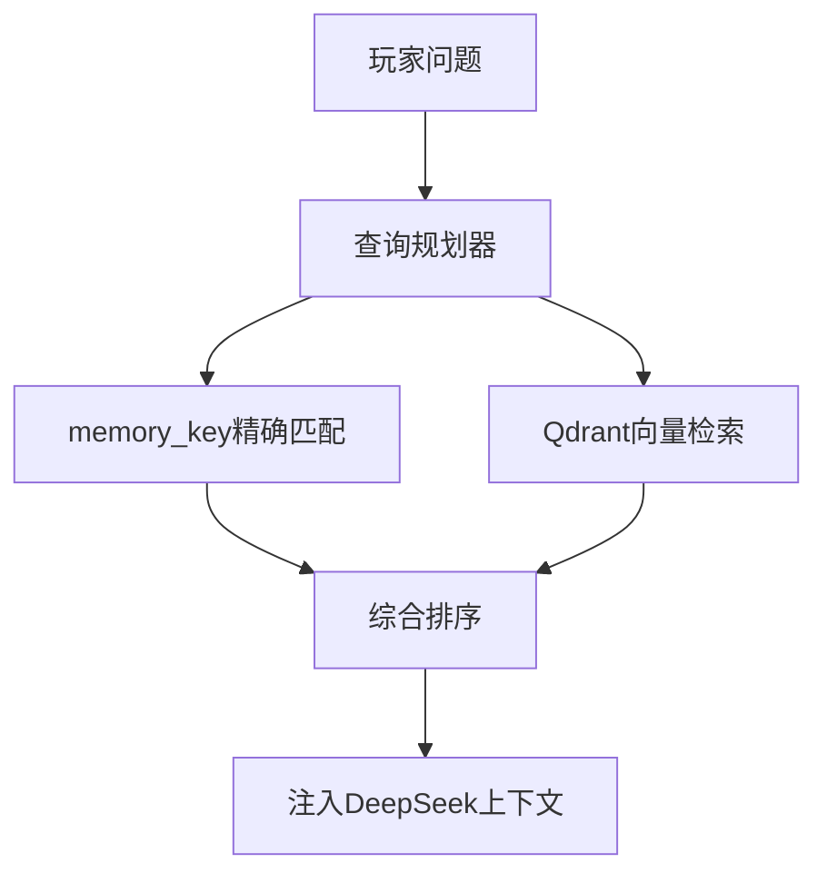

# 🌆 赛博小镇 Cyber Town

<div align="center">

**一个由 Godot、FastAPI、DeepSeek 与 Qdrant 驱动的 AI NPC 小镇**

玩家可以在二维小镇中自由移动，与拥有独立人设、长期记忆、好感度和动态状态的 NPC 交谈。


</div>

---

## ✨ 项目亮点

- 🎮 Godot 二维地图、碰撞、移动和 NPC 交互；
- 🤖 三个拥有独立人设的 AI NPC；
- 💬 DeepSeek 生成符合角色身份和关系等级的回复；
- 🧠 最近 5 轮工作记忆；
- 🔎 `memory_key` 精确查询与 BGE Embedding 语义检索；
- 🗄️ Qdrant 长期向量记忆，支持新增、更新、遗忘和持久化；
- 💾 JSON 保存完整对话，并作为长期记忆备份与故障回退；
- ❤️ NPC 独立好感度和关系等级；
- 🌤️ 批量生成 NPC 背景动作、情绪和台词；
- 🔒 NPC 并发占用保护、日志记录和敏感信息过滤；
- 🌐 Godot 通过 HTTP 调用 FastAPI 后端。

## 📑 目录

- [快速开始](#-快速开始)
- [环境要求](#1-环境要求)
- [克隆与安装](#2-克隆与安装)
- [配置 DeepSeek](#3-配置-deepseek)
- [启动后端](#4-启动-fastapi-后端)
- [启动 Godot](#5-启动-godot-客户端)
- [游戏操作](#-游戏操作)
- [记忆系统](#-记忆系统)
- [项目结构](#-项目结构)
- [核心 API](#-核心-api)
- [数据与隐私](#-数据与隐私)
- [常见问题](#-常见问题)
- [当前限制与扩展方向](#-当前限制与扩展方向)

---

## 🚀 快速开始

已经完成首次配置时，只需要分别启动后端和客户端：

```powershell
# 终端一：在项目根目录启动FastAPI
uv run uvicorn api:app --reload --host 127.0.0.1 --port 8000
```

随后使用 Godot 打开 `godot/project.godot`，按 `F5` 运行完整项目。

第一次使用请继续阅读下面的完整复现步骤。

---

## 1. 环境要求

| 工具 | 建议版本 | 作用 |
|---|---:|---|
| Git | 最新稳定版 | 克隆代码 |
| Python | 3.11 | 运行后端 |
| uv | 最新稳定版 | 创建环境、安装和锁定依赖 |
| Godot | 4.5 及以上 | 运行游戏客户端 |
| DeepSeek API Key | 有效密钥 | 生成 NPC 回复和结构化分析 |

本项目已在以下环境验证：

```text
Windows 11
Python 3.11
Godot 4.7.2
Qdrant Client 1.19.0（本地持久化模式）
```

检查 Python：

```powershell
python --version
```

预期为 `Python 3.11.x`。尚未安装 uv 时执行：

```powershell
python -m pip install uv
uv --version
```

> 本项目使用 Qdrant 本地持久化模式，不需要额外安装 Docker 或启动独立 Qdrant 服务。

## 2. 克隆与安装

打开 PowerShell，进入准备存放项目的目录：

```powershell
cd D:\pyproject\agent
```

克隆项目并进入根目录：

```powershell
git clone https://github.com/shark-max-ops/15_cyber-town-from-scratch.git
cd 15_cyber-town-from-scratch
```

如果不使用 Git，也可以在 GitHub 页面选择 `Code → Download ZIP`，下载并解压。

正确的项目根目录至少包含：

```text
api.py
pyproject.toml
uv.lock
godot/
```

安装锁定版本的全部 Python 依赖：

```powershell
uv sync
```

uv 会自动创建 `.venv`，并安装 FastAPI、OpenAI 客户端、Sentence Transformers 和 Qdrant Client 等依赖。

验证主要依赖：

```powershell
uv run python -c "import fastapi, openai, sentence_transformers, qdrant_client; print('依赖安装成功')"
```

## 3. 配置 DeepSeek

复制环境变量模板：

```powershell
Copy-Item .env.example .env
```

打开项目根目录下的 `.env`，填写：

```env
LLM_API_KEY=你的DeepSeek_API密钥
LLM_BASE_URL=https://api.deepseek.com
LLM_MODEL=deepseek-v4-flash
```

注意：

- 不要在等号两侧添加空格；
- API Key 两侧不需要引号；
- 不要将真实 `.env` 上传到 GitHub；
- `.env.example` 只能保留示例值。

## 4. 启动 FastAPI 后端

在项目根目录执行：

```powershell
uv run uvicorn api:app --reload --host 127.0.0.1 --port 8000
```

第一次启动会下载或加载 `BAAI/bge-small-zh-v1.5`。如果出现下面的 Hugging Face 提示，但程序仍继续加载，可以暂时忽略：

```text
Warning: You are sending unauthenticated requests to the HF Hub
```

启动过程中会自动执行：

```text
加载BGE Embedding模型
→ 打开data/qdrant本地数据库
→ 创建或复用cyber_town_memories集合
→ 初始化长期记忆管理器
→ 初始化NPC、好感度、状态和日志组件
```

成功时应看到类似输出：

```text
Qdrant集合已存在：cyber_town_memories
Qdrant长期记忆存储器创建成功
赛博小镇后端服务启动成功
Application startup complete.
```

不要关闭该终端，Godot 需要通过它访问 AI 后端。

- 健康检查：<http://127.0.0.1:8000/health>
- Swagger API 文档：<http://127.0.0.1:8000/docs>
- NPC 状态：<http://127.0.0.1:8000/npcs/status>

## 5. 启动 Godot 客户端

1. 打开 Godot 项目管理器；
2. 点击“导入”；
3. 选择 `godot/project.godot`；
4. 点击“导入并编辑”；
5. 等待资源扫描结束。

进入 `项目 → 项目设置 → 全局`，确认存在并启用：

```text
Config     res://scripts/config.gd
APIClient  res://scripts/api_client.gd
```

`godot/scripts/config.gd` 中的后端地址应为：

```gdscript
const API_BASE_URL := "http://127.0.0.1:8000"
```

NPC 映射应为：

```gdscript
const NPC_IDS := {
	"林舟": "lin_zhou",
	"王教授": "wang_professor",
	"康康": "kang_kang",
}
```

打开 `res://scenes/main.tscn`，按 `F5` 运行。如果提示没有设置主场景，选择“选择当前场景”。

正常情况下，后端会收到：

```text
GET /background HTTP/1.1 200 OK
GET /npcs/status HTTP/1.1 200 OK
```

---

## 🎮 游戏操作

| 按键 | 功能 |
|---|---|
| `W/A/S/D` | 玩家移动 |
| 方向键 | 玩家移动 |
| `E` | 与附近 NPC 交互 |
| `Enter` | 发送对话 |
| `Esc` | 关闭对话框 |
| `R` | 强制刷新全部 NPC 背景状态 |
| `F8` | 停止 Godot 游戏 |

按 `R` 会真实调用 DeepSeek 重新生成背景，不建议连续快速触发。

## 👥 NPC 列表

| `npc_id` | 姓名 | 身份 |
|---|---|---|
| `lin_zhou` | 林舟 | 赛博小镇物资管理员 |
| `wang_professor` | 王教授 | 图书馆管理员兼退休物理学教授 |
| `kang_kang` | 康康 | 赛博小镇居民和邮差老周的孩子 |

每个 NPC 拥有独立的人设、原始对话档案、工作记忆、Qdrant 长期记忆、好感度和运行状态。

## 🧠 记忆系统

每轮回复使用：

```text
NPC角色提示词
+ 最近5轮工作记忆
+ Qdrant检索到的相关长期记忆
+ 当前好感度
+ 玩家本轮消息
```

### 长期记忆写入



### 长期记忆查询



综合排序参考 `memory_key` 精确命中、Qdrant 余弦相似度、记忆重要度、提取可信度和更新时间。

Qdrant 是结构化长期记忆的正式存储。JSON 仍负责完整对话档案，并保留向量记忆备份；只有 Qdrant 查询异常时，系统才回退到 JSON 手动相似度检索。

### 旧项目数据迁移

旧版 `*_vector_memory.json` 已含有效结构化记忆时，先停止 FastAPI，再执行：

```powershell
uv run python migrate_json_to_qdrant.py
```

需要从完整历史对话重新调用 DeepSeek 提取记忆时执行：

```powershell
uv run python migrate_memory.py
```

第二条命令会产生多次真实 API 调用，通常只在记忆规则升级后使用。

## 🧱 项目结构

```text
15-cyber-town-from-scratch/
├── api.py                         # FastAPI入口与路由
├── api_models.py                  # API请求和响应模型
├── application_context.py         # 后端组件统一初始化和关闭
├── dialogue_service.py            # 单轮NPC对话业务流程
├── main.py                        # 终端版赛博小镇入口
│
├── config.py                      # 环境变量与Qdrant路径配置
├── npc.py                         # NPC提示词和回复生成
├── npc_profiles.py                # NPC人设资料
├── agents.py                      # 多NPC统一管理
│
├── memory.py                      # 对话档案、JSON回退检索
├── memory_models.py               # 结构化长期记忆模型
├── memory_extractor.py            # DeepSeek长期记忆提取器
├── memory_query_planner.py        # 长期记忆查询规划器
├── qdrant_memory_store.py         # Qdrant底层增删改查
├── qdrant_memory_manager.py       # Qdrant记忆业务与JSON备份
├── migrate_json_to_qdrant.py      # 旧向量JSON迁移到Qdrant
├── migrate_memory.py              # 从完整对话重新提取长期记忆
│
├── affinity_analyzer.py           # 玩家态度分析
├── relationship_models.py         # 好感度数据模型
├── relationship_manager.py        # 好感度管理
├── background_models.py           # NPC背景状态模型
├── batch_dialogue.py              # 批量背景状态生成
├── background_cache.py            # 背景状态缓存
├── scene_context.py               # 动态小镇场景描述
├── state_models.py                # NPC运行状态模型
├── state_manager.py               # NPC状态和并发管理
├── dialogue_logger.py             # 对话及错误日志
│
├── data/                          # Qdrant、JSON记忆和关系数据
├── logs/                          # 本地运行日志
├── md/                            # 项目文档
├── godot/                         # Godot客户端工程
├── .env.example                   # 环境变量模板
├── .gitignore
├── pyproject.toml
└── uv.lock
```

更详细的模块关系见 [`项目架构说明.md`](md/项目架构说明.md)。

## 🧰 技术栈

| 分类 | 技术 |
|---|---|
| 后端 | Python 3.11、FastAPI、Uvicorn、Pydantic |
| 大模型 | DeepSeek API、OpenAI 兼容客户端 |
| 语义模型 | Sentence Transformers、`BAAI/bge-small-zh-v1.5` |
| 向量数据库 | Qdrant Client 本地持久化模式 |
| 游戏客户端 | Godot 4、GDScript、HTTPRequest、CharacterBody2D |
| 本地数据 | Qdrant、JSON、JSONL 日志 |

## 🌐 核心 API

| 方法 | 路径 | 功能 |
|---|---|---|
| `GET` | `/health` | 检查后端运行状态 |
| `GET` | `/npcs/status` | 获取全部 NPC 状态 |
| `GET` | `/npcs/{npc_id}/status` | 获取单个 NPC 状态 |
| `POST` | `/dialogue` | 与指定 NPC 完成一轮对话 |
| `GET` | `/affinity/{npc_id}/{player_id}` | 查询好感度 |
| `GET` | `/background` | 获取或生成背景状态 |
| `POST` | `/background/refresh` | 强制刷新背景状态 |

对话请求示例：

```json
{
  "npc_id": "lin_zhou",
  "player_id": "default_player",
  "player_message": "你还记得我喜欢喝什么吗？"
}
```

## 🔐 数据与隐私

以下目录默认不应提交到 Git：

```text
data/
logs/
```

其中可能包含玩家完整对话、Qdrant 长期记忆与 Embedding、向量 JSON 备份、NPC 好感度、背景缓存和运行日志。

清理 `data/qdrant/` 会删除 Qdrant 长期记忆；但如果 `*_vector_memory.json` 备份仍在，可以重新运行迁移脚本恢复。

## 🛠️ 常见问题

### FastAPI 无法启动

确认终端位于项目根目录，然后执行：

```powershell
uv sync
uv run uvicorn api:app --reload --host 127.0.0.1 --port 8000
```

### 浏览器无法访问 127.0.0.1:8000

确认后端终端仍显示 `Uvicorn running on http://127.0.0.1:8000`。

### Qdrant 提示存储已被占用

本地模式不允许两个独立进程同时打开同一个 `data/qdrant` 目录。先停止 FastAPI，再运行迁移脚本或其他直接访问 Qdrant 的命令。

正常关闭后端：在 FastAPI 终端按 `Ctrl + C`。

### Godot 显示网络请求失败

检查：

- FastAPI 是否仍在运行；
- `API_BASE_URL` 是否为 `http://127.0.0.1:8000`；
- 浏览器能否打开 `/health`；
- Windows 防火墙是否阻止 Godot 联网。

### `POST /dialogue` 返回 422

请求体必须使用 `npc_id`、`player_id` 和 `player_message`，不能把 `player_message` 写成 `message`。

### 后端提示 NPC 不存在

正确编号为 `lin_zhou`、`wang_professor` 和 `kang_kang`。康康是 `kang_kang`，不是 `kangkang`。

### Godot 提示 `Unrecognized UID`

关闭 Godot，将 `godot/.godot` 重命名为 `godot/.godot_old`，再打开工程，让 Godot 重建资源缓存。

## 📌 当前限制与扩展方向

当前版本属于可运行的 AI NPC 原型，尚有以下限制：

- 使用固定玩家编号 `default_player`；
- Qdrant 采用单机本地嵌入模式，暂不支持多实例服务；
- 玩家账户、任务、背包等结构化数据尚未接入 MySQL/PostgreSQL；
- NPC 巡逻尚未使用完整导航系统；
- 暂未实现多人在线和流式回复；
- Godot 客户端主要连接本地 FastAPI。

后续可以继续扩展：

1. 将本地 Qdrant 切换为 Docker、Qdrant Server 或 Qdrant Cloud；
2. 使用 MySQL/PostgreSQL 保存账号、任务、背包和世界状态；
3. 使用 WebSocket 实现流式回复和多人位置同步；
4. 增加任务、道具、商店和奖励循环；
5. 增加 NPC 之间的主动对话和世界事件；
6. 将天气、时间和节日事件注入 NPC 情绪与行为；
7. 使用 Godot Navigation 完善 NPC 寻路。

---

<div align="center">

从一个会说话的 NPC，逐步构建一个会记忆、会变化、会与你建立关系的 AI 小镇。

</div>
