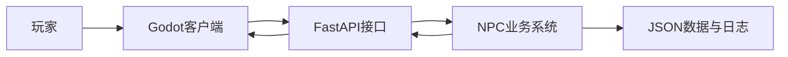
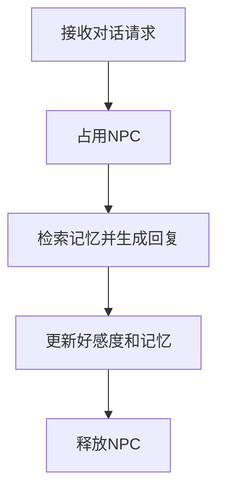
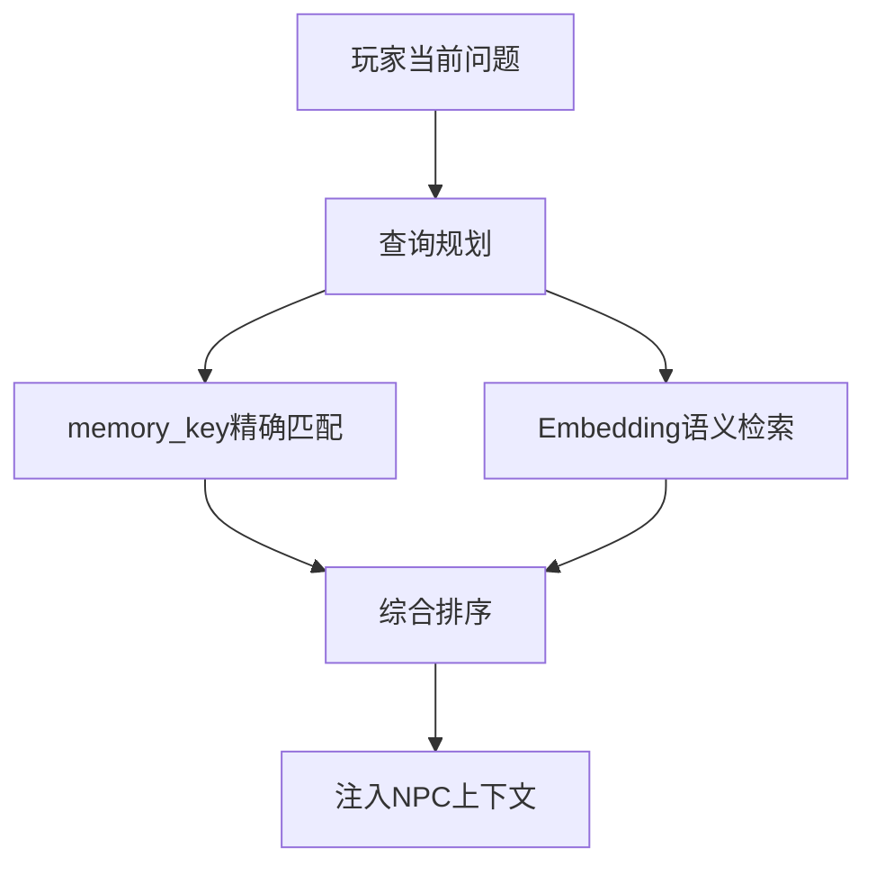
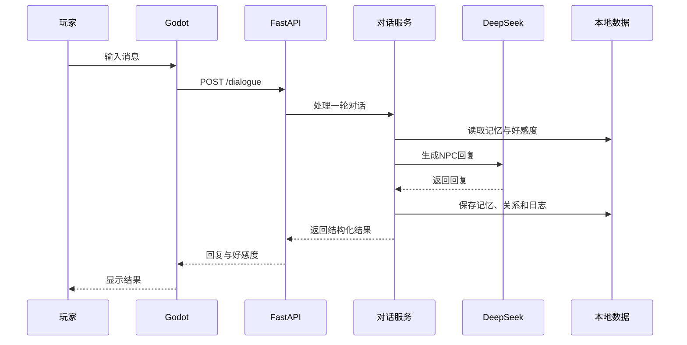

# 赛博小镇项目架构说明

## 一、整体架构

项目分为Godot客户端和Python后端。



Godot负责：

- 地图显示；
- 玩家移动；
- NPC场景；
- 对话界面；
- 键盘输入；
- HTTP请求；
- NPC状态展示。

Python负责：

- NPC人设；
- DeepSeek调用；
- 工作记忆；
- 长期记忆；
- Embedding检索；
- 好感度；
- 背景状态；
- 并发控制；
- 数据保存；
- 对话日志。

## 二、后端分层

### 1. API层

主要文件：

```text
api.py
api_models.py
```

职责：

- 定义HTTP接口；
- 校验请求数据；
- 返回结构化响应；
- 将HTTP错误转换为状态码；
- 配置CORS；
- 管理FastAPI启动与关闭。

API层不直接编写复杂NPC逻辑，而是调用业务服务。

### 2. 应用管理层

主要文件：

```text
application_context.py
dialogue_service.py
```

`application_context.py`负责集中初始化：

- DeepSeek客户端；
- Embedding模型；
- NPC管理器；
- 记忆提取器；
- 查询规划器；
- 好感度管理器；
- 背景生成器；
- 状态管理器；
- 日志管理器。

`dialogue_service.py`负责组织完整的一轮对话。



无论对话成功还是失败，都通过`finally`释放NPC，防止NPC永久处于忙碌状态。

### 3. NPC层

主要文件：

```text
npc.py
npc_profiles.py
agents.py
```

`npc_profiles.py`保存NPC结构化人设。

`npc.py`负责：

- 构建系统提示词；
- 组合工作记忆；
- 注入长期记忆；
- 注入好感度；
- 调用DeepSeek；
- 返回NPC回复。

`agents.py`统一管理多个NPC对象，避免在主程序中写死大量分支。

## 三、记忆系统

主要文件：

```text
memory.py
memory_models.py
memory_extractor.py
memory_query_planner.py
migrate_memory.py
```

### 1. 工作记忆

工作记忆只保存最近5轮对话，用于维持当前上下文。

```text
一轮 = 一条玩家消息 + 一条NPC回复
```

每次请求只发送最近5轮，避免Token消耗不断增加。

### 2. 完整对话档案

全部对话保存在JSON文件中，用于：

- 跨重启保存；
- 长期历史追踪；
- 生成工作记忆；
- 调试NPC行为。

完整档案不会全部发送给大模型。

### 3. 结构化长期记忆

长期记忆不是直接保存所有句子，而是由DeepSeek提取结构化事实。

典型字段：

```text
action
memory_type
memory_key
value
summary
importance
confidence
sensitive
source_text
embedding
```

记忆动作包括：

```text
REMEMBER：新增或更新记忆
FORGET：删除对应记忆
NONE：本轮不产生长期记忆
```

### 4. 长期记忆检索



查询规划器负责判断：

- 当前问题是否需要长期记忆；
- 可能对应哪些`memory_key`；
- 应该使用什么语义查询文本；
- 当前规划的置信度。

最终排序综合考虑：

- memory_key是否精确匹配；
- Embedding语义相似度；
- 记忆重要性；
- 记忆可信度。

## 四、好感度系统

主要文件：

```text
affinity_analyzer.py
relationship_models.py
relationship_manager.py
```

好感度范围：

```text
0～100
```

关系等级：

```text
陌生
熟悉
友好
亲密
挚友
```

处理流程：

```text
玩家消息
→ DeepSeek分析玩家态度
→ 判断正向、普通或负向
→ 计算分数变化
→ 检测重复消息
→ 保存最新关系
→ 下一轮影响NPC语气
```

重复发送同一条夸奖不会无限增加好感度。

## 五、背景状态系统

主要文件：

```text
scene_context.py
batch_dialogue.py
background_models.py
background_cache.py
state_manager.py
```

背景系统会根据时间生成场景描述，再通过一次DeepSeek请求批量生成三个NPC的：

- 当前动作；
- 情绪；
- 背景台词。

使用一次批量请求而不是每个NPC单独请求，可以减少：

- API调用次数；
- Token消耗；
- 等待时间；
- NPC状态不一致。

背景状态会被缓存。Godot按R时调用：

```text
POST /background/refresh
```

强制忽略缓存并重新生成。

## 六、NPC状态和并发控制

主要文件：

```text
state_models.py
state_manager.py
```

状态管理器保存：

- NPC坐标；
- 是否忙碌；
- 当前活动；
- 当前动作；
- 当前情绪；
- 背景台词；
- 当前交互玩家；
- 最后交互时间。

`RLock`用于保护共享NPC状态，防止多个请求同时修改相同数据。

对话开始时：

```text
检查NPC
→ 尝试占用NPC
→ 标记talking
```

对话结束时：

```text
释放NPC
→ 清除当前玩家
→ 恢复idle
```

## 七、Godot客户端

主要脚本：

```text
config.gd
api_client.gd
main.gd
player.gd
npc.gd
dialogue_ui.gd
```

### config.gd

负责：

- FastAPI地址；
- NPC姓名和npc_id映射；
- 玩家编号；
- 移动速度；
- 状态刷新间隔；
- 调试设置。

### api_client.gd

负责：

- 创建HTTPRequest节点；
- 请求FastAPI；
- 解析JSON；
- 处理HTTP错误；
- 发出Godot信号。

### main.gd

负责：

- 初始化三个NPC；
- 将旧场景节点映射为新NPC；
- 启动背景状态加载；
- 定时获取NPC状态；
- 监听R键刷新背景；
- 将后端状态分发给NPC。

### player.gd

负责：

- WASD和方向键移动；
- CharacterBody2D物理碰撞；
- 检测附近NPC；
- 按E开始交互；
- 对话时停止移动；
- 玩家动画和音效。

### npc.gd

负责：

- NPC姓名和身份；
- 随机巡逻；
- 玩家进入交互范围检测；
- 对话期间停止移动；
- 动作、情绪和背景台词展示；
- NPC动画。

### dialogue_ui.gd

负责：

- 显示NPC姓名和身份；
- 接收玩家输入；
- 显示NPC回复；
- 显示好感度；
- 控制等待状态；
- 关闭对话后恢复移动。

## 八、完整对话数据流



## 九、模块解耦原则

项目没有把全部代码堆放在`main.py`或`api.py`中，而是按照职责拆分。

优点：

- 修改记忆检索时不需要改Godot；
- 修改NPC人设时不需要改API；
- 修改API路由时不需要改记忆模型；
- 终端客户端和Godot客户端可以共用同一套后端；
- 单个模块出现问题时更容易定位；
- 后续能够替换数据库、模型或客户端。

## 十、当前边界

当前版本属于可运行的AI NPC原型，已经实现核心闭环，但还不是完整商业游戏。

已经完成：

```text
玩家移动
NPC交互
AI对话
多NPC
长期记忆
好感度
背景状态
前后端通信
本地持久化
```

尚未实现：

```text
登录系统
任务系统
背包和道具
商店
正式地图寻路
多人在线
服务端数据库
流式回复
打包部署
```