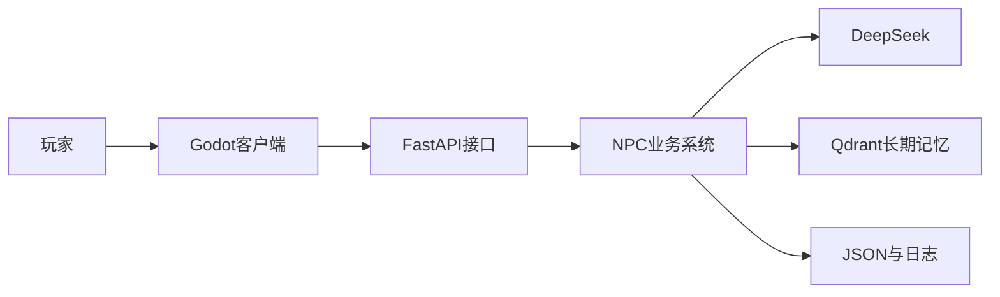
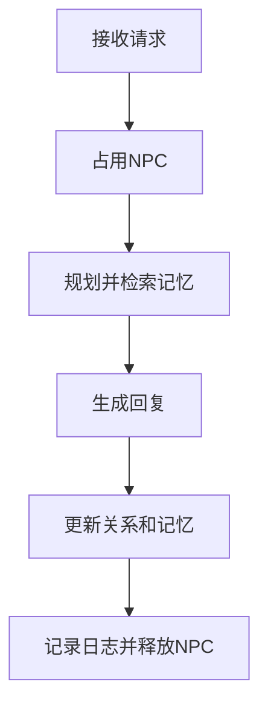
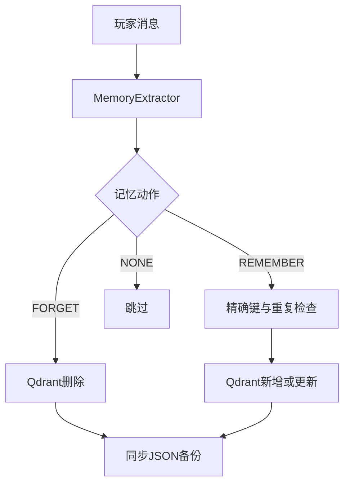
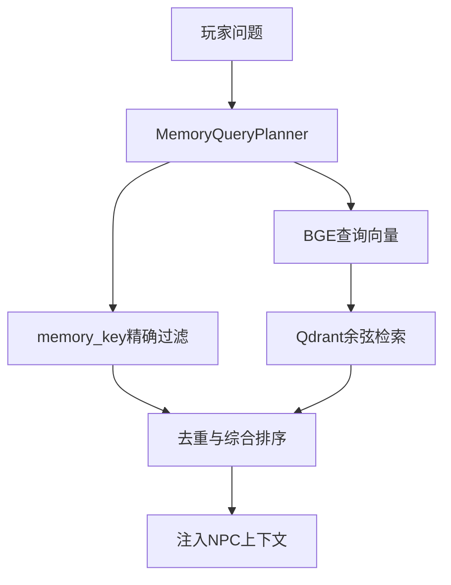
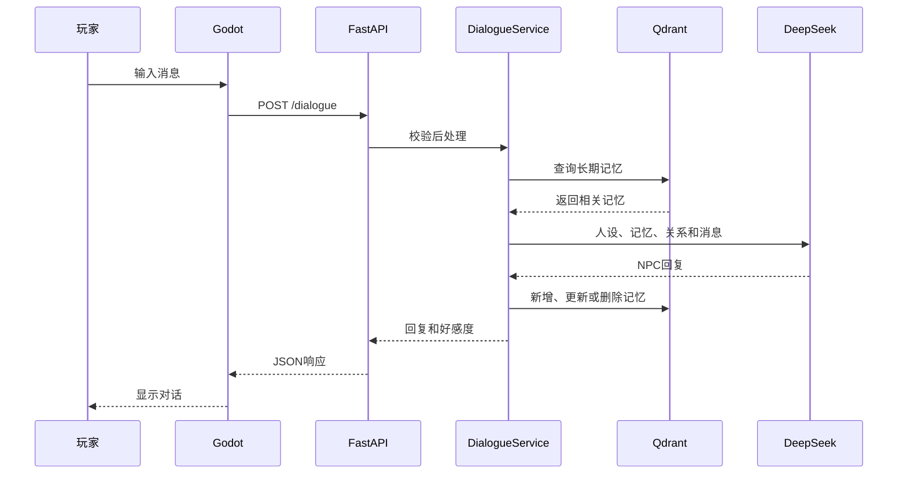

# 赛博小镇项目架构说明

本文档说明 Godot 客户端、FastAPI 后端、DeepSeek、Qdrant 与本地 JSON 数据之间的职责边界和调用流程。

## 一、整体架构



| 组成部分 | 主要职责 |
|---|---|
| Godot | 地图、移动、NPC、UI、输入和 HTTP 通信 |
| FastAPI | API 路由、请求校验、生命周期和错误响应 |
| NPC 业务系统 | 对话编排、人设、记忆、好感度、状态和日志 |
| DeepSeek | NPC 回复、记忆提取、查询规划、态度分析和背景生成 |
| Qdrant | 结构化长期记忆、Embedding、过滤与相似度检索 |
| JSON/JSONL | 原始对话、关系、背景缓存、向量备份和运行日志 |

## 二、后端分层

### 1. API 层

主要文件：

```text
api.py
api_models.py
```

职责：

- 定义 HTTP 路由；
- 使用 Pydantic 校验请求与响应；
- 配置 CORS；
- 将业务异常转换为 HTTP 状态码；
- 在 FastAPI 启动和关闭时管理公共组件。

API 层不直接编写复杂 NPC 逻辑，而是调用 `DialogueService`。

### 2. 应用与业务编排层

主要文件：

```text
application_context.py
dialogue_service.py
```

`ApplicationContext` 在一个后端进程中统一创建：

- DeepSeek 客户端；
- BGE Embedding 模型；
- Qdrant 存储器与记忆管理器；
- NPC 管理器；
- 记忆提取器和查询规划器；
- 好感度、背景、状态和日志组件。

它避免每个请求重复加载模型或打开 Qdrant。FastAPI 关闭时会调用 `shutdown()`，释放数据库文件锁和 LLM 客户端。

`DialogueService` 组织一轮完整对话：



NPC 释放位于 `finally` 中，因此模型调用、记忆或日志出现异常时，也不会让 NPC 永久处于忙碌状态。

### 3. NPC 层

主要文件：

```text
npc.py
npc_profiles.py
agents.py
```

- `npc_profiles.py`：保存 NPC 的姓名、身份、性格和背景；
- `npc.py`：构建提示词、组合上下文并调用 DeepSeek；
- `agents.py`：统一创建、查找和管理多个 NPC。

## 三、记忆系统

### 1. 模块划分

```text
memory.py                      对话档案、工作记忆、JSON回退检索
memory_models.py               MemoryCandidate、StoredMemory等模型
memory_extractor.py            从玩家消息提取结构化长期记忆
memory_query_planner.py        判断是否需要记忆并生成查询计划
qdrant_memory_store.py         Qdrant底层增删改查和过滤
qdrant_memory_manager.py       ADD/UPDATE/DELETE判断和JSON备份
migrate_json_to_qdrant.py      已有向量JSON迁移到Qdrant
migrate_memory.py              从完整对话重新调用DeepSeek提取记忆
```

### 2. 三类记忆

| 类型 | 存储位置 | 用途 |
|---|---|---|
| 工作记忆 | 运行时从对话档案截取 | 最近 5 轮上下文 |
| 完整对话档案 | `data/{npc_id}_memory.json` | 跨重启历史、调试和重建记忆 |
| 结构化长期记忆 | `data/qdrant/` | 精确查询和语义检索 |

`data/{npc_id}_vector_memory.json` 现在是 Qdrant 长期记忆的备份，不再是正常检索的主数据源。

### 3. 长期记忆结构

一条正式记忆主要包含：

```text
memory_id
npc_id
player_id
memory_type
memory_key
value
summary
importance
confidence
source
source_text
created_at
updated_at
embedding
```

其中：

- `npc_id` 防止不同 NPC 共享私人记忆；
- `player_id` 防止不同玩家的记忆混合；
- `memory_key` 用于识别和更新同一属性；
- `summary` 用于生成 Embedding；
- `embedding` 作为 Qdrant 向量保存；
- 其余结构化字段作为 Qdrant payload 保存。

### 4. 长期记忆写入



保存质量控制包括：

- 敏感信息不长期保存；
- 置信度和重要度必须达到阈值；
- 相同 `memory_key` 更新原记录；
- 同类型且极高相似度的记录视为重复；
- `FORGET` 删除对应 Qdrant Point。

### 5. 长期记忆查询



综合排序参考：

- `memory_key` 精确匹配；
- Qdrant 语义相似度；
- 记忆重要度；
- 提取可信度；
- 更新时间新鲜度。

### 6. 主存储、备份和回退

```text
正常读取：Qdrant
正常写入：Qdrant → 同步向量JSON备份
完整聊天：原始对话JSON
Qdrant异常：读取向量JSON并使用NumPy余弦相似度回退
```

Qdrant 返回 0 条是正常查询结果，不会触发回退；只有真正抛出数据库异常时才使用 JSON。

本地 Qdrant 由整个进程共享一个客户端。FastAPI 运行期间，不应再启动另一个直接打开同一 `data/qdrant` 目录的迁移进程。

## 四、好感度系统

主要文件：

```text
affinity_analyzer.py
relationship_models.py
relationship_manager.py
```

处理流程：

```text
玩家消息
→ DeepSeek分析态度
→ 计算候选变化
→ 检测重复表达
→ 限制最终分数
→ 保存关系记录
→ 下一轮影响NPC语气
```

好感度范围是 `0～100`，对应陌生、熟悉、友好、亲密、挚友等关系等级。重复发送同一条夸奖不会无限增加好感度。

## 五、背景状态系统

主要文件：

```text
scene_context.py
batch_dialogue.py
background_models.py
background_cache.py
state_manager.py
```

系统根据时间和场景描述，通过一次 DeepSeek 请求批量生成全部 NPC 的动作、情绪和背景台词。批量生成可以减少 API 次数、Token 消耗和 NPC 之间的场景矛盾。

背景状态带有缓存；Godot 按 `R` 时调用：

```text
POST /background/refresh
```

强制忽略缓存并重新生成。

## 六、NPC 状态与并发控制

主要文件：

```text
state_models.py
state_manager.py
```

状态管理器保存 NPC 坐标、活动状态、动作、情绪、背景台词、当前交互玩家和最后交互时间。

`RLock` 保护共享状态，使“检查 NPC 是否空闲”和“将 NPC 标记为忙碌”成为同一次原子操作：

```text
开始：检查NPC → 尝试占用 → 标记talking
结束：释放NPC → 清除玩家 → 恢复背景状态
```

## 七、Godot 客户端

| 文件 | 职责 |
|---|---|
| `config.gd` | FastAPI 地址、NPC 映射、玩家编号和游戏参数 |
| `api_client.gd` | HTTPRequest、JSON 解析、错误处理和信号 |
| `main.gd` | 主场景、背景刷新和 NPC 状态分发 |
| `player.gd` | 移动、碰撞、附近 NPC 检测和交互 |
| `npc.gd` | NPC 巡逻、交互范围、动画和状态显示 |
| `dialogue_ui.gd` | 输入、回复、等待状态和好感度显示 |

Godot 只依赖 HTTP API，不直接读取 Python 的 JSON 或 Qdrant 数据，因此可以独立替换界面和地图，而不需要重写记忆系统。

## 八、完整对话时序



记忆提取和好感度分析还会产生额外 DeepSeek 调用；任一附加步骤失败时，业务服务会尽量保留 NPC 已生成的回复并记录错误。

## 九、数据持久化

```text
data/
├── qdrant/                         # 正式长期向量记忆
├── {npc_id}_memory.json            # 完整原始对话
├── {npc_id}_vector_memory.json     # Qdrant记忆备份
├── relationships.json              # 好感度
└── background_dialogues.json       # 背景状态缓存

logs/
└── *.jsonl                          # 对话、状态和错误日志
```

这些文件可能包含玩家个人信息，不应直接提交到公开仓库。

## 十、模块解耦原则

- 修改 Godot 地图时不需要修改记忆系统；
- 修改 NPC 人设时不需要修改 API 路由；
- 更换 DeepSeek 兼容模型时主要调整环境变量；
- Qdrant 底层操作集中在 `QdrantMemoryStore`；
- 记忆业务规则集中在 `QdrantMemoryManager`；
- FastAPI 与终端入口共用 `ApplicationContext` 和 `DialogueService`；
- JSON 回退使向量数据库暂时故障时仍能降级运行。

## 十一、当前部署边界

当前版本是本地单机 AI NPC 原型：

```text
已实现：Godot + FastAPI + DeepSeek + BGE + Qdrant + Memory + Affinity
未实现：账号、任务、背包、商店、多人同步和正式部署
```

Qdrant 当前以嵌入式本地模式运行。它满足项目的向量数据库与 RAG 需求，但不适合多个后端进程同时访问同一目录。

项目尚未使用 MySQL。未来可以进一步分离职责：

```text
MySQL或PostgreSQL
→ 玩家账号、NPC资料、任务、背包、关系和世界状态

Qdrant Server或Cloud
→ 长期记忆文本、Embedding、memory_key和语义检索
```

这样结构化业务数据与向量语义数据可以分别扩展和维护。
